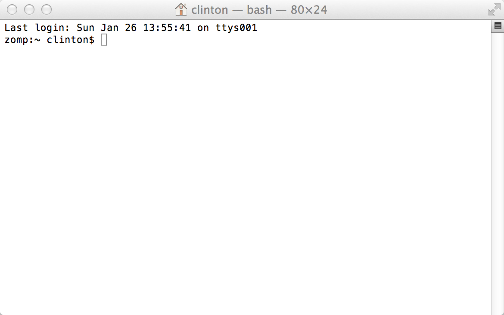
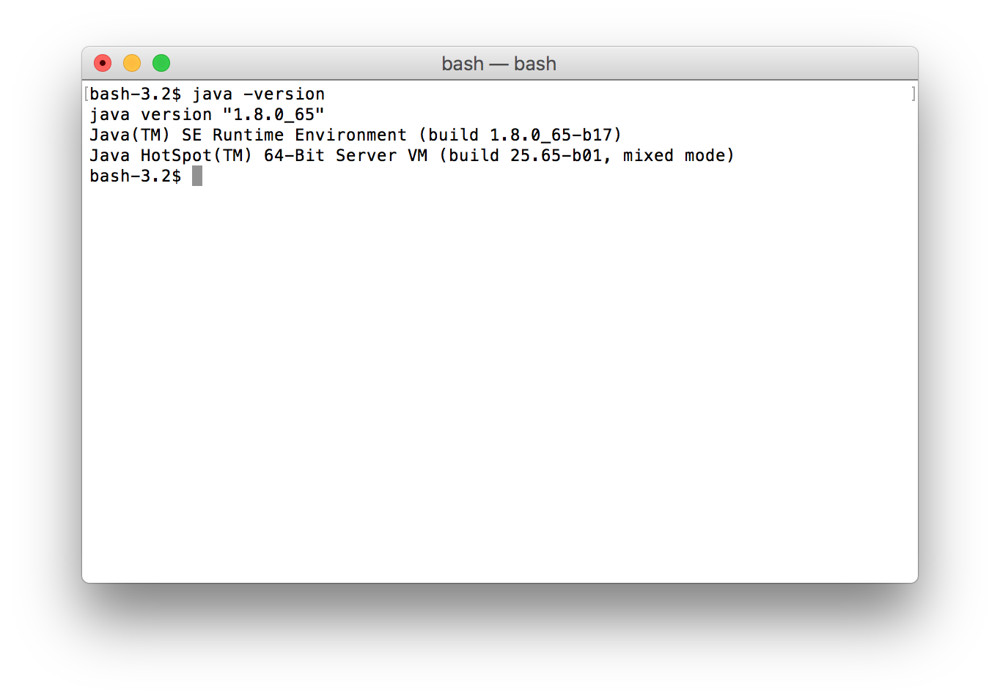
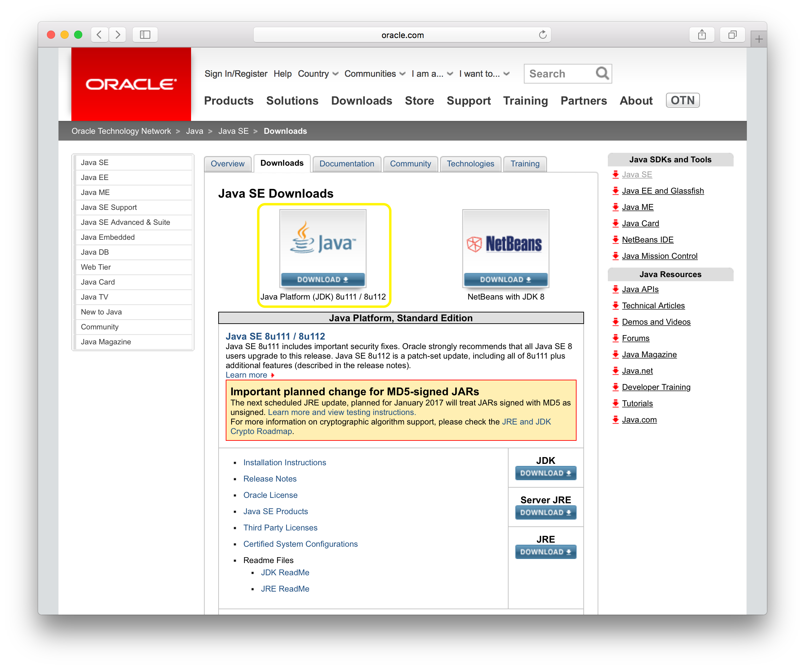
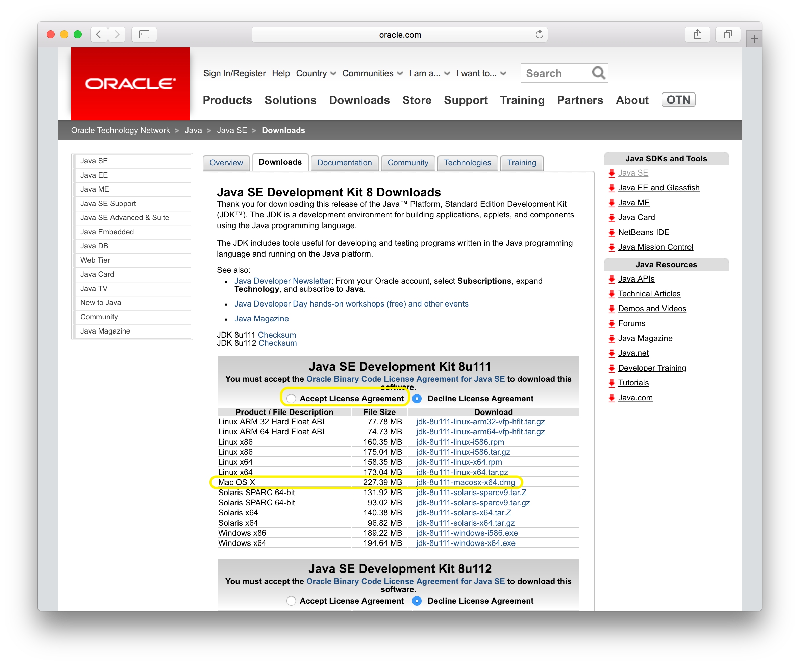
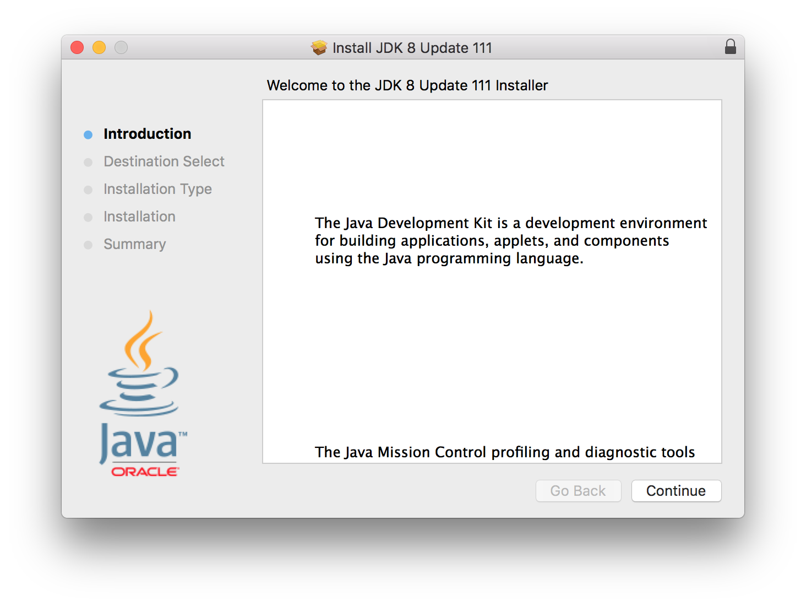

OS X Setup
==========

* [Start a terminal](#starting-a-terminal)
* [Make sure Java is installed](#making-sure-java-is-installed)
* [Get Leiningen installed](#installing-leiningen)
* [Test installation](#testing-your-setup)

## Starting a terminal

For these instructions, and for much of the class, you will need to have a terminal, or command line, open. This is a text-based interface to talk to your computer, and you can open it by running Terminal.app, which is found under `/Applications/Utilities`. If you have never used the terminal before, you may want to spend some time [reading up on command-line basics](http://blog.teamtreehouse.com/command-line-basics).

Go ahead and open your terminal now. It should look something like this:



The prompt (where you will type your commands) may look different: it usually shows the computer name and user name, as well as the folder or directory you are currently in.

For the rest of this setup, I will tell you to run commands in your terminal. When I say that, I mean "type the command into the terminal and press the Return key."

## Making sure Java is installed

Run `java -version` in your terminal.

If Java is installed, you will see something like this in your terminal:



If Java is not installed, or the version number is less than 1.8 you can download it here [Java Downloads](http://www.oracle.com/technetwork/java/javase/downloads/index.html)



Click the Java download button.



Accept the license agreement, and download the version for Mac OS X.

Double-click the jdk-8u111-macosx-x64.dmg file in your Downloads directory and walk through the installer.



## Installing Leiningen

Leiningen is a tool used on the command line to manage Clojure projects.

To install `lein`, execute the following commands in your terminal. You will be prompted to enter your password.

```bash
curl https://raw.githubusercontent.com/technomancy/leiningen/stable/bin/lein > lein
sudo mkdir -p /usr/local/bin/
sudo mv lein /usr/local/bin/lein
sudo chmod a+x /usr/local/bin/lein
cd $HOME
echo 'PATH=$PATH:/usr/local/bin' >> .bashrc
source .bashrc
```

After you run the above commands, run the `lein version` command. It should take a while to run, as it will download some resources it needs the first time. If it completes successfully, you are golden! If not, ask an instructor for help.

## Testing your setup

You have set up Java, Leiningen, Atom and Git on your computer--all the tools you will need for this course. Before starting, we need to test them out.

Go to your terminal and run the following command:

```
git clone https://github.com/clojurebridge-dc/clojure-koans.git

```

This will check out a sample Clojure application from GitHub, a central repository for lots of source code. Your terminal should look similar to this picture:


Then run the command:

```
cd clojure-koans
```

This will put you in the directory with the source code for this sample bit of Clojure code. After that completes, run:

```
lein repl
```

This could take a long time, and will download many other pieces of code it relies on. You should see lines that start with `Retrieving ...` on your screen.


This is starting a REPL, which we will learn about soon. It's a special terminal for Clojure. At the REPL prompt, type `(+ 1 1)` and press Return. Did you get the answer `2` back? You will learn more about that in the course.

For now, enter `(quit)` to quit the REPL. _(NOTE: you can also type `(exit)` or press the Control button and D button on your keyboard together)_.
This should take you out of the Clojure REPL and back to your normal terminal prompt.

You should still be in the `clojure-koans` directory.

Congratulations! That website is running code you have on your computer that you have uploaded. You have actually made a very simple Clojure app, and your computer is all set up to make more.

