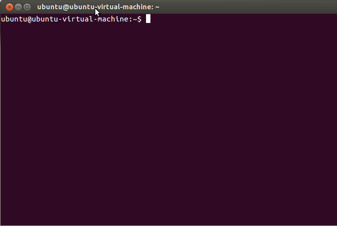
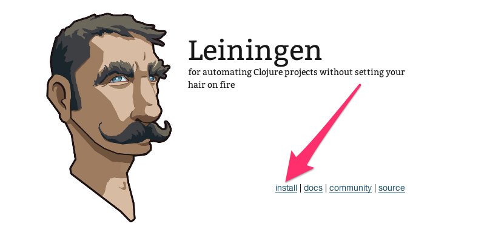

Linux Setup
===========

## Starting a terminal

For these instructions, and for much of the class, you will need to have a terminal, or command line, open. This is a text-based interface to talk to your computer, and you can open it by clicking "Dash Home" and typing `Terminal`. You can also open a terminal at any time by pressing `CTRL-ALT-T`. If you have never used the terminal before, you may want to spend some time [reading up on command-line basics](http://blog.teamtreehouse.com/command-line-basics).

Go ahead and open your terminal now. It should look something like this:



The prompt (where you will type your commands) may look different: it usually shows the computer name and user name, as well as the folder or directory you are currently in.

For the rest of this setup, I will tell you to run commands in your terminal. When I say that, I mean "type the command into the terminal and press the Return key."

## Installing Git and Ruby

The **git** version control system is packaged for your Linux distribution.
On Debian Ubuntu systems you can install it with the following
*(as the superuser)*:

```
root@mylaptop# apt-get update
root@mylaptop# apt-get install git git-core git-man ruby
```

*NOTE: We are installing Ruby because it's needed by the Heroku Command Line Interface*

## Installing Java

On Ubuntu you should be able to install Java with:

```
sudo apt install default-jdk
```
## Installing Leiningen

Leiningen is a tool used on the command line to manage Clojure projects.

Go to the [Leiningen website](http://leiningen.org/). You will see a link to the `lein` script under the "Install" heading. Right-click that link and choose "Save Link As...". Save it in your Downloads directory.




After that, run the following commands in your terminal:

```
clojurista@mylaptop$ mkdir ~/bin
clojurista@mylaptop$ cd ~/bin
clojurista@mylaptop$ mv ~/Downloads/lein ./
clojurista@mylaptop$ chmod +x lein
clojurista@mylaptop$ lein version
Leiningen 2.7.1 on Java 1.8.0_112 Java HotSpot(TM) 64-Bit Server VM
clojurista@mylaptop$
```

After you run the above commands, run the `lein version` command. It should take a while to run, as it will download some resources it needs the first time. If it completes successfully, you are golden! If not, ask an instructor for help.

## Testing your setup

You have set up Java, Leiningen, Atom and Git on your computer--all the tools you will need for this course. Before starting, we need to test them out.

Go to your terminal and run the following command:

```
git clone https://github.com/clojurebridge-dc/clojure-koans.git

```

This will check out a sample Clojure application from GitHub, a central repository for lots of source code. Your terminal should look similar to this picture:


Then run the command:

```
cd clojure-koans
```

This will put you in the directory with the source code for this sample bit of Clojure code. After that completes, run:

```
lein repl
```

This could take a long time, and will download many other pieces of code it relies on. You should see lines that start with `Retrieving ...` on your screen.


This is starting a REPL, which we will learn about soon. It's a special terminal for Clojure. At the REPL prompt, type `(+ 1 1)` and press Return. Did you get the answer `2` back? You will learn more about that in the course.

For now, enter `(quit)` to quit the REPL. _(NOTE: you can also type `(exit)` or press the Control button and D button on your keyboard together)_.
This should take you out of the Clojure REPL and back to your normal terminal prompt.

You should still be in the `clojure-koans` directory.

Congratulations! That website is running code you have on your computer that you have uploaded. You have actually made a very simple Clojure app, and your computer is all set up to make more.
