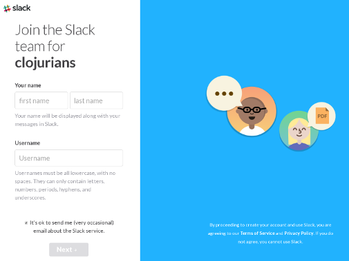
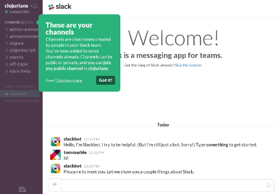

Slack
=====

## Request an invitation to Clojurians Slack

In a web browser go to [http://clojurians.net/](http://clojurians.net/)
and enter your e-mail address to get an invitation.

## Click on the link from your e-mail and register

Check your e-mail for the message from Slack and click the link
to complete your registration:

## Sign in to Slack

Sign in to Slack and click on "Explore Slack".

## Join the #clojurebridgedc channel

Now in the upper right search box enter **#clojurebridgedc** -- this
is the channel for ClojureBridgeDC students and volunteers. When you see the
channel listed in search results.. click on it. Then click the **Join** button
at the bottom of the page.